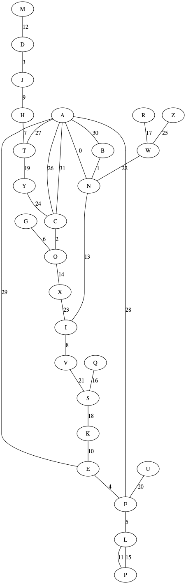

# Enigma 模拟与破解

## Enigma 模拟

使用 Rust 代码模拟了 http://enigmaco.de/enigma/enigma.html 上的 Enigma ，实现在 src/lib.rs 中。

代码中预定义了五个转子，分别由它的代换表和缺口的位置决定：

```rust
    pub static ref ROTOR_1: Rotor = Rotor::new("EKMFLGDQVZNTOWYHXUSPAIBRCJ", 'Q');
    pub static ref ROTOR_2: Rotor = Rotor::new("AJDKSIRUXBLHWTMCQGZNPYFVOE", 'E');
    pub static ref ROTOR_3: Rotor = Rotor::new("BDFHJLCPRTXVZNYEIWGAKMUSQO", 'V');
    pub static ref ROTOR_4: Rotor = Rotor::new("ESOVPZJAYQUIRHXLNFTGKDCMWB", 'J');
    pub static ref ROTOR_5: Rotor = Rotor::new("VZBRGITYUPSDNHLXAWMJQOFECK", 'Z');
```

与提供的 Excel 表格一致。类似地，反射器定义：

```rust
    pub static ref REFLECTOR: Mapping = Mapping::new("YRUHQSLDPXNGOKMIEBFZCWVJAT");
```

一个 Enigma 机有三个参数：用了哪三个转子、三个转子的初始位置都在哪里、接线板的映射关系。网站上的默认配置就是：

```rust
    let enigma = Enigma::new([1, 2, 3], [7, 3, 23], *IDENTITY);
```

第一个参数 1 2 3 分别代表用的是 1 2 3 号转子，7 3 23 指的是 H D X 也就是转子的初始位置， IDENTITY 表示接线板没有进行交换。

在代码中编写了若干测试，并且得到了和网站上模拟的 Enigma 相同的结果。

## 波兰法破解 Enigma

波兰法利用的是信息密钥的特征：连续两次的三个字母（ABCABC），那么第一个字母和第四个字母、第二个字母和第五个字母、第三个字母和第六个字母的置换群是由转子的配置（顺序、位置）和接线板决定的。对于同样的转子的配置，无论接线板怎么接，对应的置换群总是同构。

既然是同构的，我们就把置换群的分解作为特征，也就是课件上所说的字母链。破解就是，枚举所有的 `26*26*26*3!=105456` 种转子的配置，对每种配置，加密 AAAAAA BBBBBB 直到 ZZZZZZ ，求出它的特征（字母链），保存在一个表中。

当截取到足够的密文的时候，会得到一系列的形如 ABCABC 的明文对应的密文，如果数量足够，我们就可以还原出置换群的配置，按照这个配置去反查转子的配置，这个时候，虽然并不能得出接线板的配置，但依然可以得到很多信息。

这个过程写在 src/bin/poland.rs 中。要运行它，执行 `cargo run --bin poland` 。输出的内容大致如下：

第一行是 `keys: 20680` ，表示字母链的可能一共只有 20680 种，意味着原来 105456 种配置，现在只有期望 105456 / 20680 = 5.1 种配置，这还是相当方便的。

第二行列出了可能的配置：

```
possible: [([1, 2, 3], [7, 3, 23]), ([1, 2, 3], [9, 24, 3]), ([2, 1, 3], [0, 2, 1]), ([2, 1, 3], [5, 20, 5]), ([2, 3, 1], [3, 17, 0]), ([2, 3, 1], [15, 18, 25]), ([3, 1, 2], [0, 24, 19]), ([3, 1, 2], [3, 21, 19])]
```

代码中，模拟了一个破解过程，加密方加密了 AAAAAA BBBBBB 到 ZZZZZZ（只是方便置换群的重建，实际上可以是任意的，只要出现了足够多的组合），然后破解方截取到了这些密文，计算出特征，反查得到了上面这些可能的结果。`([1, 2, 3], [7, 3, 23])` 表示的是按照 1 2 3 转子的顺序，分别在 7 3 23 的位置上的配置。

之后，对于每种可能的配置，把密文解密出来，以第一个为例：

```
for setting [1, 2, 3] [7, 3, 23]:
NIIQIE -> GFOGWA
RNJKRM -> HHXFHH
WLOVWO -> IZIIII
TYXJUI -> JJJDJO
GULLFA -> NKZWOE
XZZWEL -> LLLLAF
ETWRKK -> PAAALG
SQTMNV -> BBBBBB
QAAYAD -> CTWCES
VWBDYS -> DDTJDD
PMMBGG -> EEEMCK
MCEEOF -> FGMHFL
LKKHSB -> XUFEMV
ABSUHZ -> KQNNRN
ZXCZLC -> OOGOKJ
KRVXZY -> APPPPP
IHRAXW -> WNQRQQ
BPQGBU -> SRRQNR
HVNTMJ -> RSSSSC
DGHSVX -> VCDTTT
YEYNDR -> UMUUYU
JSPCTH -> TVVYVM
CJGFCQ -> QYCKGW
FODPQT -> MXHXXX
UDUIJP -> YWYVUY
OFFOPN -> ZIKZZZ
score: 24
```

可以看到，因为接线板的存在，解出来的原文很多并不是 ABCABC 形式的，有很多地方不正确，但也有部分完全匹配，如 BBBBBB，更多是只差一个字母，如 IZIIII，APPPPP，UMUUYU，YWYYUY；这些情况下基本可以把实际的原文范围缩小到几个，只要把这些原文作为信息密钥去解密剩下的密文，就可以解出很多信息了。

最后一行的 score 表示的是信息密钥中对应位置（1和4，2和5，3和6）相同字母的个数，越高说明这个转子的配置可能性越大。可以看到除了第一种组合，剩下的组合分数都不高，所以在第一个配置的基础上，稍微枚举一下信息密钥的几种可能性，就可以解出来信息的大概，再去猜测接线板的对应关系。

这个破解方法针对的是早期的 Enigma 机，它的特点是插线板只交换了六对字母，这使得最后一步可以得到许多密钥，如果交换了十对，这个方案的效果会差很多，导致最后一步推断不出信息密钥。另外，它依赖信息密钥的 ABCABC 形式，如果信息密钥不再重复，这个方法就失效了。


## 图灵法破解 Enigma

波兰法针对的是信息密钥的特征进行破解，但在转子变多或者插线板交换十对的时候可行性会变差。图灵法则是针对已知明文攻击，它的好处是与插线板的交换数无关，只和转子的配置有关，并且已知明文越长，得到密钥就更容易。

图灵法的第一步是针对已知明文和密文进行分析。代码里选取了以下的密文和明文：

```
Plain: ABCDEFGHIJKLMNOPQRSTUVWXYZAAAAAA
Encrypted: NNOJFLOTVHEPDIXLSWKYFSNICWCTFEBC
```

首先按照对应位置，建立无向图：`A <-> N`, `B <-> N`, `C <-> O` ... `A <-> C` 。得到如下的图：



每个节点表示的是一个字符，边就是在明文中的下标。我们以 A 为起始点，可以找到如下的五个环：

```
A -> C -> A
A -> B -> N -> A
A -> E -> F -> A
A -> C -> Y -> T -> A
A -> N -> I -> X -> O -> C -> A
```

然后，就可以枚举 `26*26*26*3!=105456` 种转子的配置。对于每种配置，循环尝试把 A 替换为 A 到 Z ，按照原来的位置计算上面的五个环。如果对这五个环计算出来的结果都吻合，说明这个配置可能是正确的。如果这些环是独立的，那么每多一个环，密钥的范围就会缩小到 1/26 ，所以已知明文越多，就又有越大的概率得到密钥。

代码实现在 src/bin/turing.rs 中，用 `cargo run --bin turing` 进行执行。输出如下：

```
NNOJFLOTVHEPDIXLSWKYFSNICWCTFEBC
cycle [26, 31] is correct
cycle [30, 1, 0] is correct
cycle [29, 4, 28] is correct
cycle [26, 24, 19, 27] is correct
cycle [0, 13, 23, 14, 2, 26] is correct
num of possible: 1
possible: [([1, 2, 3], [7, 3, 23])]
```

第一行是密文，之后几行是验证上面的环确实是正确的。然后开始枚举所有的密钥，找到只有一个可能的情况，这样就破解出来了。

如果只用四个环，则可能得到不止一个解：

```
cycle [26, 31] is correct
cycle [30, 1, 0] is correct
cycle [29, 4, 28] is correct
cycle [26, 24, 19, 27] is correct
num of possible: 4
possible: [([1, 2, 3], [7, 3, 23]), ([1, 2, 3], [9, 7, 25]), ([2, 1, 3], [19, 4, 13]), ([3, 2, 1], [8, 1, 14])]
```

如果把五个转子都用上，那么搜索空间会变大 10 倍，但只要在明文上找到多一个环，就依然可以得到密文。所以这个方法是比较好的。
